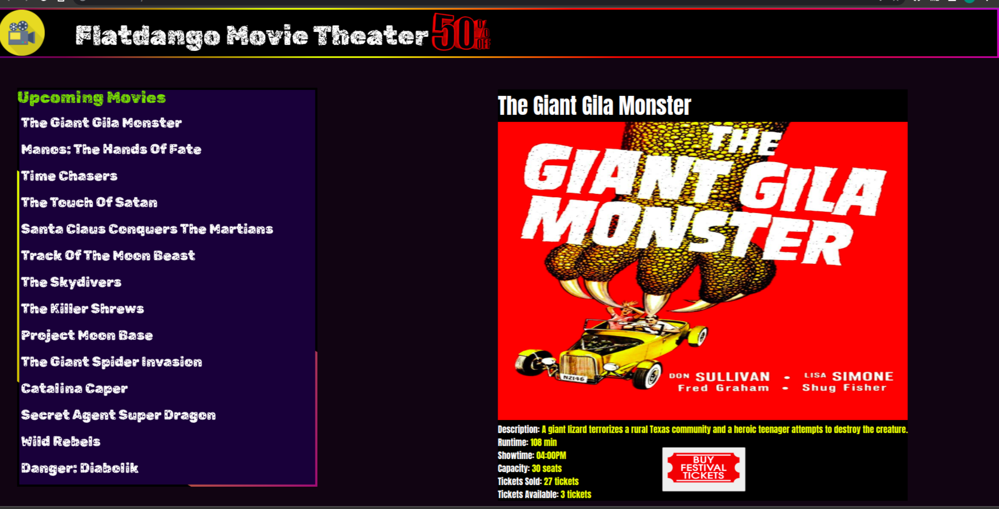

# flatdango

## Description

This is a web application that allows a user to purchase movie tickets from the theater and also it shows movies available at that day and status of availabilty of tickets and time it will be played and duration.

## Live Page

https://khalid-zein.github.io/flatdango/

## installation

1. Open terminal(Ctrl+Alt+T)

2. git clone        

        git@github.com:khalid-zein/flatdango.git

3. flatdango

4. code . or atom . depending on the text editor of your choice.

5. install json package 

        npm install -g json-server

6. run backend server in terminal 

        json-server --watch db.json

## Technologies Used

1. [HTML](https://)
2. [CSS](https://)
3. [Javascript](https://)

## Screenshot of live page

## BDD

|Behaviour                         | Input                                 |                                                 output|
| ---------------------------------| ------------------------------------- | ----------------------------------------------------- |
| click(Any upcoming movie listed) |                                       |   output movie detail icluding name playtime ...(etc) |
| click(Buy Festival Tickets)      |                                       |   it shows you number of tickets remaining after your purchase, your ticket number and brief description of the movie you want to watch|

## Author:

[Khalid Zein](https:yueyyt)

## Contact

+254794794734

Email: zeinkhalid004@gmail.com

## License
[MIT](https://choosealicense.com/licenses/mit/)
